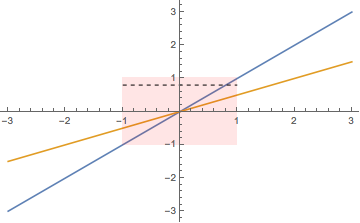

I and my collaborators Irina Kogan and Kris Jenssen have submitted a paper on
our new theorem.

We'll have a preprint of the paper on the arXiv soon, and I'll update this post
with a link then. *Update: the preprint is
[here](https://arxiv.org/abs/1803.09147)*. However, it will not be an easy read
for non-mathematicians, so I will describe the result informally for the
non-expert reader in this post. The reader will need to know enough calculus to
know what a directional derivative is, and ideally will have taken a course in
differential equations.

# Background: Overdetermined systems

The theorem deals with overdetermined systems of differential equations.
Overdetermined systems are those that have more equations than unknowns. In
general, we expect overdetermined systems to have no solutions.

We can make a simple analogy with linear (algebraic) equations. Imagine a
simple system of two linear equations with two unknowns:

$$ \begin{align}
x + y &= 4; \\
5 x -4 y &= 2 .
\end{align} $$

This system has the unique solution $x=2; y=2$. But if we impose also the third
equation

$$ x - y = 1 , $$

the new system has no solutions. This is what we generally expect to happen when
we have more equations than unknowns: there are too many constraints and not
enough degrees of freedom.

On the other hand, if we instead impose as third equation

$$ 6x -3y = 6, $$

the new system of three equations still has the same solution $x=2; y=2$. This
is because the equations are linearly dependent (in this case, the third
equation is the sum of the first two equations). Thus we see that if the system
satisfies compatibility conditions, there may be a solution after all even in
the overdetermined case.

To bring the discussion back to differential equations, consider looking for
an unknown function $u$ of two variables $(x,y)$ that we expect to satisfy
the differential equation

$$u_x = u. $$

The solution is $u(x,y) = f(y) e^x$, for any differentiable function $f$. On the
other hand, if we impose an arbitrary additional differential equation, say
$u\_y = x$, we expect to find no solutions at all. But if the second
differential equation is special, say $u\_y = u$, we see that we do have the
solution $u(x,y) = C e^y e^x$ for any constant $C$. This works out because the
differential equations satisfy the compatibility condition $u\_{yx} = u\_{xy}$.

So, to summarize this section: Most overdetermined systems do not have
solutions, but when certain compatibility conditions are satisfied, they may.

# Background 2: The Frobenius Theorem

The Frobenius Theorem is a classical result. It has several different
formulations, but the one most relevant for us is that if we are seeking an
unknown function of several variables, say $u(x,y,z)$, and every directional
derivative is specified (so that this is not just an overdetermined system, but
a *completely determined* one), in this case $u_x$, $u_y$, and $u_z$, and the
appropriate compatibility conditions are satisfied, then for any specified value
$u(x_0,y_0,z_0) = u_0$, there is locally a unique solution.

So this is one simple case in which overdetermined systems are guaranteed to
have unique solutions.

# Background 3: A Theorem of Darboux

In the early 20th century the French mathematician Darboux published a
generalization of the Frobenius Theorem, applicable to systems which are not
completely determined. In Darboux's theorem, there may be multiple unknown
functions, say $u$, $v$, and $w$, and each of them have directional derivatives
specified only in certain directions. Moreover, data is prescribed along the
coordinate hyperplanes in the other directions. That is, if $u_x$ and $u_y$
appear in differential equations, then the values $u(0,0,z)$ along the $z$ axis
are prescribed. Different unknowns may have different partial derivatives
specified.

Darboux showed, again, that if the system satisfies compatibility conditions,
there is locally a unique solution.

# The Current Theorem

We were faced with systems of equations that were similar to Darboux's case, but
with some complications. Firstly, our equations didn't just have partial
derivatives like $u_x$, but instead directional derivatives in the direction of
arbitrary vector fields $r$, like $r(u)$. Secondly, our prescribed data was not
necessarily along coordinate hyperplanes, but instead along almost arbitrary
manifolds transverse to the vector fields. These complications add considerable
difficulty.

We were reasonably confident that, when certain compatibility conditions were
satisfied, unique solutions existed. However, it was not at all clear that
Darboux's proof could be extended to the new case. Darboux's proof relied on a
complicated induction scheme, first proving the result in the case of two
independent variables, then in the case of three. And then, in principle, one
could keep going and prove the result for four or more independent variables.
But Darboux did not do this; he stopped at three and then simply implied it was
clear that the same scheme would continue to work. This is something that was
acceptable in his time, but no longer. Moreover, regardless of the complications
Darboux had to contend with, the approach seems to be completely untenable in
our more general situation.

# Picard Iteration

The answer was to extend a classical technique, Picard iteration, to our new
problem. Picard iteration is a method originally used for solving Ordinary
Differential Equations (that is, differential equations involving one
independent variable). In principle it can be used to actually construct
solutions, but actually it is used more as a theoretical tool to prove that
solutions exist. For finding numerical solutions in practice there are better
methods, such as the Runge-Kutta methods.

I'll describe how Picard iteration works in the ODE case.

$$ \begin{align}
u'(x) &= f(u, x) \\
u(0) &= C .
\end{align} $$

If we had a solution, then by the fundamental theorem of calculus it would satisfy
this simple integral equation:

$$ u(x) = C + \int_0^x f(u(x), x) \, dx . $$

This suggests an iteration scheme. We could start with a guess at a solution;
call it $u_0(x)$. Then insert this guess $u_0$ into the right hand side of the
equation, and we'll have a new function which will be our next guess:

$$ u_1(x) = C + \int_0^x f(u_0(x), x) \, dx . $$

And so on:

$$ u_2(x) = C + \int_0^x f(u_1(x), x) \, dx . $$

Subject to some general requirements on $f$, it can be proved that this scheme
will converge to a solution of our problem. Actually, in the modern approach,
one doesn't even *iterate*; instead, we just use the right hand side of the
equation as an operator on functions and show that it has a fixed point, which
is our solution.

This was done long ago, but a version of it turns out to be a great approach for
our new, modern problem. It gets a little hairy because we have to integrate in
multiple directions, and we're integrating along the integral curves of various
vector fields instead of just along a line, and so on, but the core idea is
similar.

There's also an extra wrinkle because, due to the overdetermined nature of the
system, the solution we (theoretically) construct is a priori only guaranteed to
satisfy the differential equations along certain manifolds. So we then have to
go back and prove that it really does satisfy the system everwhere. This is
where the compatibility conditions come into play. The details are technical;
see the paper (and/or email me).

I'm pleased with the Picard iteration approach, and I think it's a cleaner way
to prove the result, even if all we care about is Darboux's simpler case.

# A Final Complication

It turns out there's a final problem. For geometric reasons, we have to put some
restrictions on the manifolds where data are prescribed. Consider this scenario:
We are looking for solutions to the system

$$ \begin{align}
u_x(x,y) &= f(u,x,y) \\
v_y(x,y) &= g(v,x,y) \\
\end{align} $$

Thus this is not really an overdetermined system (there are two equations and
two unknowns), and in fact it's not really even a *system* in any meaningful
sense, because the equations for $u$ and $v$ are completely decoupled. The only
thing that makes it a system of equations is that we have decided we want a
single neighborhood on which both systems have a unique solution.

We prescribe data for $u$ along the line $y= \frac 1 2 x$, and data for $v$
along the line $y = x$. The following plot illustrates our situation.

Data for $u$ is prescribed along the orange line, and data for $v$ is prescribed
along the blue line. The transparent red rectangle is the open neighborhood of
the origin on which we are going to look for a solution. But there's a problem.
For a lot of points in our neighborhood, for instance the points along the
dotted line, $u$ has no influence from the prescribed data. This is because it's
the $x$ derivative that's been prescribed for $u$, but some horizontal lines
don't hit the orange curve within the red neighborhood. Thus we actually have a
lot of flexibility in constructing $u$, and there is certainly not a unique
solution.

This neighborhood is not suitable for finding solutions to the $u$ equation. So
we could pick a new neighborhood to solve that problem, but then we'd run into
the same problem with the $v$ equation. There is no neighborhood that's suitable
for finding solutions to both the $u$ and $v$ equation.

When we discovered this obstacle, it seemed almost silly, because it's not even
really related to what seemed to be the core difficulties of our systems. Here
is an extremely simple system, only involving partial derivatives and where data
is prescribed along lines, and *the equations are not even coupled*, and yet it
presents a problem.

One way out of this may be to relax our uniqueness requirement. It's possible
that we may still be able to obtain some kind of uniqueness result if we say,
for instance, that what we really want is that if solutions are *defined* on
some larger neighborhood, they are *equal* on some smaller neighborhood. I'm not
sure whether that's true, but that's one route that could be explored.

Instead, because it wasn't clear whether the weaker uniqueness result would be
useful, we decided to simply throw out this situation entirely, and so we
include as a hypothesis of our theorem a requirement that the system satisfies
what we call the *stable configuration condition*, which ensures that the
problem I'm discussing here never happens.

# The Analytic Case

It's worth noting that there is a powerful result, the Cartan–Kähler Theorem,
that can be used to solve systems of equations like the one under discussion
here. The major drawback of this theorem is that it only applies to analytic
systems. Analytic functions are those which are equal to their power series.
Unfortunately, this usually isn't good enough. In most areas of differential
equations, to construct a useful theory and to solve practical problems we need
to be able to solve non-analytic equations.

There's a similar phenomenon in classical Partial Differential Equations with
the Cauchy-Kovalevskaya Theorem, which is powerful and in some respects very
general, but again only applies to the analytic case. My understanding of the
history is that early on it was thought that the Cauchy-Kovalevskaya Theorem
would be basically the last word on PDEs. It seemed there was an easy way to
solve any PDE, even a non-analytic one: approximate your equations and data by
analytic equations and data, and solve that new system. If your approximate
system is very close to your real system you're actually interested in, your
approximate solution should be very close to the real solution.

But it was soon realized that the situation isn't so simple. There are systems,
so-called ill-posed systems, where close approximations to the system don't lead
to close approximations to the solution.

Thus the Cauchy-Kovalevskaya Theorem is historically a major result in PDEs, and
is usually learned by students early on, but in actual practice is rarely used.

# Final Comments

There aren't a lot of results on overdetermined systems in the non-analytic
case, so I'm glad we were able to contribute one that we've found useful.
