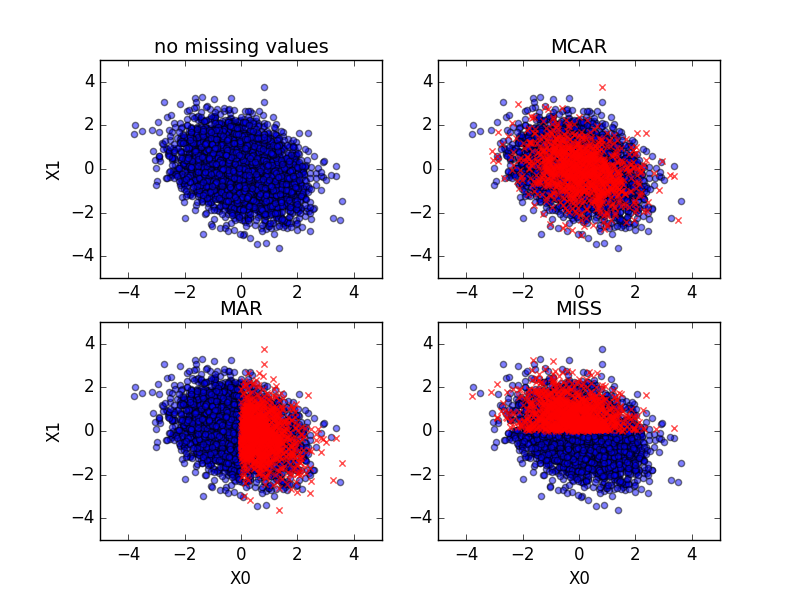
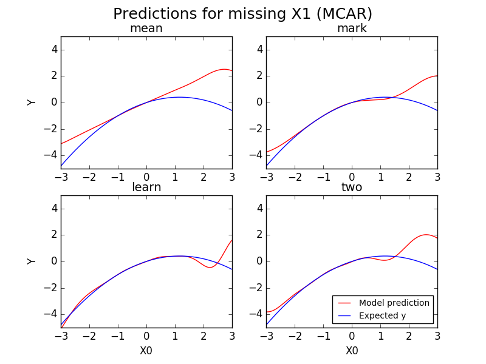
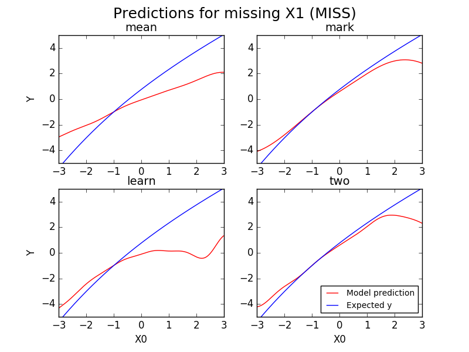
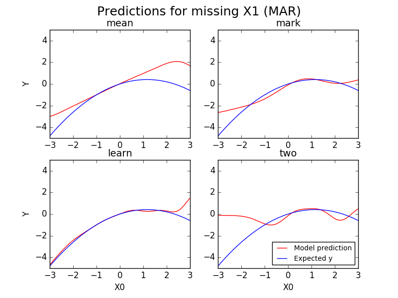

$$\newcommand{\P}{\mathbf P}$$
$$\newcommand{\E}{\mathbf E}$$

# Introduction

Several strategies for learning in the presence of missing data are in common
use. In this post I'll apply some of these strategies to an artifically
generated dataset and show that one of the common strategies, mean imputing, is
a poor approach. I'm going to use artificial data to more clearly illustrate
the different ways in which data can be missing.

# The data

Suppose we have random variables $(X_0,X_1)$ sampled from a multivariate
normal distribution with mean $(0,0)$ and covariance

$$\Sigma=
\begin{pmatrix}
1 & -0.3\\
-0.3 & 1
\end{pmatrix}. $$

Now let $Y = X_0 + X_1 + X_0 X_1 + \epsilon$, where $\epsilon$ is a normal
random variable with mean $0$ and $\sigma^2=0.0025$ (the noise in the
data).

We will sample $5000$ data points $(X_0,X_1)$, and then discard some of the
$X_1$ values. We will train regressors to predict $Y$. The data points
which will have $X_1$ discarded are selected based on one of these three
approaches:

1. In the *missing completely at random* (MCAR) approach, 20% of the data
points are selected uniformly from among all $5000$ points.

2. In the *missing at random* (MAR) approach, 40% of the data points are
considered, but of those, only those with $X_0 \ge 0$ are selected.

3. In the *just plain missing* (MISS) approach, 40% of the data
points are considered, but of those, only those with $X_1 \ge 0$ are
selected.[^miss]

[^miss]: Note that *missing completely at random* and *missing at random* are extant technical terms. They don't in general refer to the specifics of how much data is missing that I've given here. Instead MCAR refers to the fact that whether the data is missing doesn't depend on $X_0$ or $X_1$, while MAR refers to the fact that whether the data is missing doesn't depend on $X_1$. On the other hand, *just plain missing* is a term I just made up.

In the Bayesian statistics literature, it seems that MCAR is considered the
ideal, but rarely occurs in practice. MAR is considered the next best thing,
because whether your data is missing does not depend on the missing data
itself. However, in some situations, MISS may in fact be preferable, because
the fact that data is missing gives us some information that partly makes up
for not being able to see $X_1$.

Here are scatter plots of the data. The blue points have $X_1$ available,
while the red crosses do not.

# Tackling the problem

Here are a few approaches to handling a dataset with some points missing
$X_1$ before passing the data to a regressor:

1. *Mean imputing*: compute the mean $\mu$ of $X_1$ among those points
where it is not missing, and  let $X_1=\mu$ for those points where it is
missing.

2. *Learn*: Train a regressor on the data where $X_1$ is available, using
$X_0$ as the single feature and $X_1$ as the target. Then use the regressor
to predict $X_1$ where it is missing.

3. *Mark*: Adjoin to each data point an additional indicator variable $X_2$
such that $X_2=0$ if $X_1$ is present and $X_2=1$ if $X_1$ is missing.
For the algorithms in sklearn, it's also necessary to give $X_1$ some value
where it is missing, so we also do mean imputing.

4. *Two*: Train one regressor on the samples where all values are available,
and a second regressor on the samples where $X_1$ is missing. When making
predictions, use the first or second regressor according to whether $X_1$ is
available or missing.

I (somewhat arbitrarily) used as a base regressor sklearn's
[`SVR`](http://scikit-learn.org/stable/modules/generated/sklearn.svm.SVR.html)
which performs support vector regression. I trained `SVR` with each of the
above four approaches on data sets with each of the three types of missing
data. I then generated $500$ test data points which were missing data
according to the same three approaches. Each model was tested and its mean
square error (MSE) was computed.

# The results

The procedure described above resulted in the MSE values given in the following
table.

|       | Mean | Learn    | Mark    | Two  |
|-------|      |          |         |      |
| MCAR  | 0.22 |   0.23   |  0.22   | 0.22 |
| MAR   | 0.65 |   0.59   |  0.59   | 0.60 |
| MISS  | 0.31 |   0.50   |  0.11   | 0.11 |

Two observations stand out in this table. Firstly, the MISS scenario allows the
most accurate predictions by far. Thus, while MCAR and MAR may simplify the
statistical analysis, they are not necessarily the most desirable scenarios in
practice.

The second is that Mark and Two are the most consistently high performing
strategies: they tie with Mean in the MCAR scenario, slightly edge out Mean in
the MAR scenario, and trounce both Mean and Learn in the MISS scenario.

It's not hard to understand why Mark and Two perform so much better in the MISS
scenario: Mean imputing is simply lying to your model. You are making up fake
data and hoping your model isn't misled too badly. In the MCAR and MAR
scenarios, this turns out to not be a complete disaster because of two factors:

1. The fact that $Y$ is a linear function of $X_1$ (up to the noise term)
means that imputing the mean of $X_1$ *given that it is missing* amounts
to the best possible estimate anyway.

2. The mean of $X_1$ is the same as the mean of $X_1$ given that it is
missing. That is, $\E[X_1] = \E[X_1 | X_1 \textrm{ is missing} ] = 0$.

But in the MISS scenario, $\E[X_1 | X_1 \textrm{ is missing} ] > 0$, and so
factor 2 does not hold. We have imputed a value that is almost assured to lead
to incorrect predictions.

Learn also can't handle MISS because $X_1$ and $X_0$ are not strongly
correlated enough to allow the regressor to predict $X_1$ based on $X_0$.

Mark and Two perform similarly because, for a regressor that can handle a high
level of nonlinearity, the indicator variable $X_2$ allows Mark to treat the
data points with $X_1$ missing differently from the data points with $X_1$
available.

We can also get a picture of the performance of the various strategies by
plotting the prediction each model makes for a given $X_0$. In these plots,
the blue curves are the expected $Y$ value, that is, $\E[Y | X_0 = x_0
\textrm{ and } X_1 \textrm{ is missing}]$. This is the prediction that would
minimize the MSE. The red curves are the predictions of each model..

First we look at predictions in the MCAR scenario.

The all look fairly similar, as was also reflected in the table of MSE values.

Now we look at predictions in the MISS scenario. In this scenario, the expected
value of $Y$ is $\E[Y | X_0 = x_0 \textrm{ and } X_1 \ge 0]$.

Now we see a clear distinction between, on the one hand, Mean and Learn and, on
the other hand, Mark and Two. Mean and Learn have been misled by the missing
data, and dramatically underestimate $Y$ when $X_0>-1$.

Finally, just for fun we look at the predictions in the MAR scenario also. This
is somewhat meaningless as, for values of $X_0 < 0$, there are never missing
$X_1$ values. In these plots I have used the same curve for the expected
$Y$ value as from the MCAR scenario even though, when $X_0<0$ this is
really meaningless. We should expect our models to predict similarly to MCAR
when $X_0 \ge 0$, but let's see how they do when $X_0<0$.

We find that, indeed, all the red curves here are pretty similar to the red
curves in MCAR in the region $X_0 \ge 0$. In $X_0<0$ Mean and Learn still
look pretty close to what they were in MCAR. It's a different story for Mark
and Two; they are way off base for $X_0<0$. Two in particular doesn't know
what to do, which isn't surprising, as we are taking a regressor that was
trained on data where $X_0 \ge 0$ always, and having it make predictions for
$X_0 < 0$.

Of course the nice thing is that *this doesn't matter*, because in the MAR
scenario we never have $X_0<0$ when $X_1$ is missing.

# Another regressor

In this section I'll repeat a small portion of the above analysis with
a [`DecisionTreeRegressor`](http://scikit-learn.org/stable/modules/generated/sklearn.tree.DecisionTreeRegressor.html)
with `max_depth=18`. Training a regressor with each strategy in each scenario
results in the following table of MSE values.

|       | Mean | Learn    | Mark    | Two  |
|-------|      |          |         |      |
| MCAR  | 0.32 |   0.87   |  0.31   | 0.34 |
| MAR   | 1.15 |   2.39   |  1.15   | 1.45 |
| MISS  | 0.18 |   0.84   |  0.18   | 0.19 |

Again, two things of note stand out. Firstly, Learn clearly works very poorly
with the `DecisionTreeRegressor`. Secondly, Mean now works just as well as Mark
and Two in the MISS scenario. What is going on? Is it possible that mean
imputing can be salvaged after all?

No, mean imputing is still a bad idea. But the `DecisionTreeRegressor` is
capable of handling a severe discontinuity in predicting $Y$ as a function of
$X_0$ and $X_1$: it can recognize that the points with $X_1$ *exactly* at
the mean behave very differently from the points with $X_1$ merely close to
the mean. Thus mean imputing works just fine. But this isn't because mean
imputing is a good idea; this regressor would be able to do the same with any
arbitrary imputed value.

# Another method

Another much more complicated method to handle missing values is multiple
imputation. For now I don't have much to say on this method, except that
I think imputing in general is the wrong approach.

# Conclusion

Mean imputing is usually a bad idea. The marking and two-model approach are
both pretty simple to implement and tend to give good results. I consider
marking to be a rough approximation of the two-model approach. Unfortunately
marking is not currently a built-in option in sklearn, but there is an [open
issue](https://github.com/scikit-learn/scikit-learn/issues/6556) to add it.

Looking at the tables of MSE values I've given, I still have one question whose
answer I'm not yet sure of. Why do both regressors perform much more poorly for
MAR data than for MCAR? I'll update this post if I find a simple reason.
